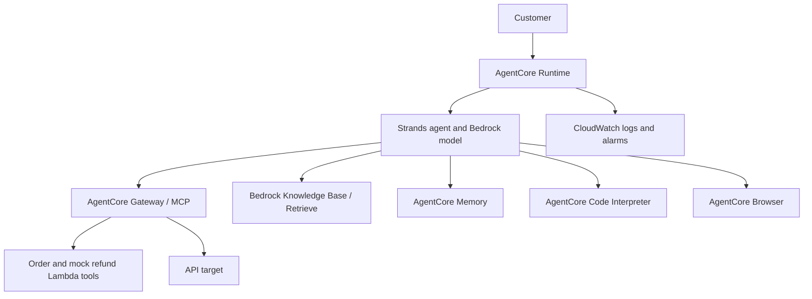

# Customer support with Amazon Bedrock AgentCore

[PDF book](AgentCore-Guided-Learning-Book.pdf) · [Online book](companion/book.md) · [Curriculum](docs/LEARNING_PATH.md) · [Resources](docs/RESOURCES.md)

## Architecture



## 1. Start offline

Install Python 3.13. From the repository root:

```powershell
python agentcore-customer-support/companion/offline/validation.py
python agentcore-customer-support/companion/offline/loyalty.py
python -m unittest discover -s agentcore-customer-support/companion/offline -p "test_*.py" -v
```

The 12 exercise tests use only the Python standard library. The offline loyalty result is explicitly labeled `offline_exercise`; it is not evidence of Code Interpreter execution.

## 2. Read and practice

Work through the book's 16 chapters, diagrams, quizzes, answer guide, and capstone. Choose the beginner, intermediate, or advanced path. Record predictions before each exercise and actual observations afterward.

## 3. Prepare the cloud environment

Follow [SETUP.md](docs/SETUP.md). Use the Python `bedrock-agentcore-starter-toolkit` workflow required by this project. Do not install another AgentCore CLI that competes for the `agentcore` executable.

The complete agent is [companion/reference/main.py](companion/reference/main.py). It requires resources in your AWS account; this repository is not a one-command infrastructure installer. The book covers creating Runtime, Gateway targets, Memory, a Knowledge Base, and the relevant roles.

## 4. Prove behavior

Follow [TESTING.md](docs/TESTING.md) for all six scenarios, cross-session recall, actual `agentcore invoke` output, and alarm evidence. Use your own real output, not the book's expected examples.

## Contents

| Path | Purpose |
| --- | --- |
| `companion/offline/` | Small exercises and 12 standard-library tests |
| `companion/cloud/` | Minimal agent, retrieval smoke test, CLI capture helper |
| `companion/reference/` | Full educational agent, pinned lockfile, Lambda fixtures, 22 boundary tests |
| `companion/assets/` | Four learning diagrams |
| `docs/` | Setup, study plan, resources, testing guide |

## Known teaching limitations

The reference enables consent bypass, accepts caller-provided customer identity, and uses unauthenticated Gateway transport. Its browser adapter depends on private SDK lifecycle details. The example Gold calculation applies a broader discount than the catalog's accessories policy; align those rules before treating a quote as authoritative. Gateway startup failure currently prevents the request, even if other tools could work. These are explicit production-extension exercises, not production guarantees.

No AWS deployment or live cloud verification is performed by repository CI. Preserve the [upstream license](companion/reference/LICENSE.txt) and read the root [notice](../NOTICE.md).
