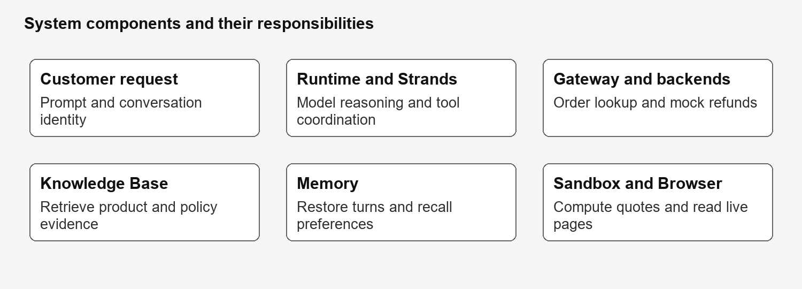
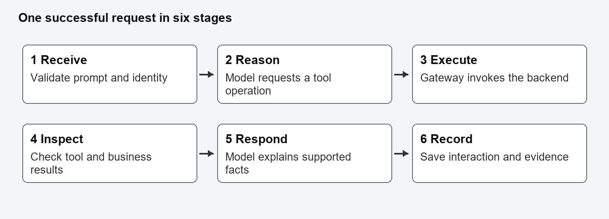
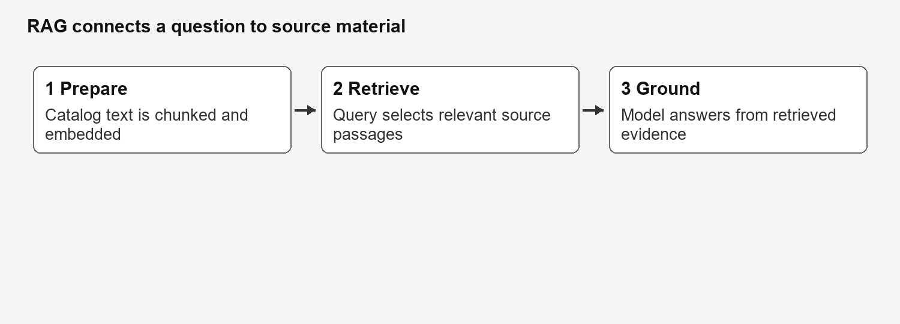
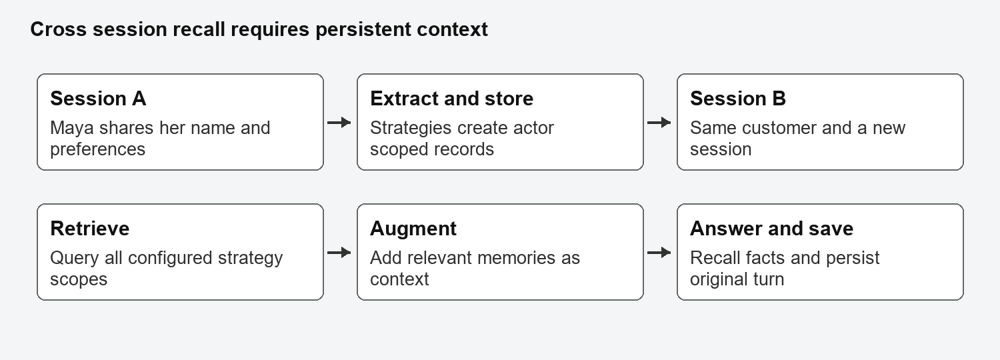

# Building an AI Customer Support Agent

## A guided book for Amazon Bedrock AgentCore and Strands

Learn to build, explain, test and operate a conversational support agent with cloud hosting, business tools, retrieval, memory, sandboxed calculations and live browsing.

First edition September 2026

For independent learners, classroom instructors and future project maintainers

This book follows a completed educational e-commerce project. It teaches the architecture and the reasoning behind the implementation, then gives you practical tasks and checks for understanding. The companion contains the complete reference agent, local exercises and tests. You can start without an AWS account by completing the offline labs.

The end goal is an agent that tracks fictional orders, handles mock refunds, retrieves catalog information, remembers preferences across sessions, calculates an exact loyalty quote and reads a live web page. Completion means you can demonstrate each capability and explain its limitations.

The examples use fictional customers and orders. The reference deployment is a classroom demonstration, not a production payment or identity system. Treat its successful tests as evidence for that specific implementation and date, not a guarantee for every future SDK release or AWS account.


# How to use this book

## Choose your learning path

Beginner path: work through every chapter in order. Allow 50 to 65 hours, including Python practice and troubleshooting. Read the explanations before running the code. Keep a notebook of predictions and observations.

Intermediate path: complete the diagnostic below, then spend most time on Chapters 5 through 13. Allow 30 to 45 hours. Attempt each exercise before reading the answer guide.

Advanced path: inspect the reference code, reproduce the evidence and focus on failure boundaries, identity, policy consistency and operational design. Allow 18 to 25 hours. Complete the production extension in Chapter 14.

The durations are learning estimates rather than service deployment promises. Cloud provisioning, permissions and asynchronous memory extraction can take additional time.

## Your study routine

1. Predict the result before running a command or test.
2. Run the smallest relevant experiment.
3. Record the actual result, including errors.
4. Explain any difference between prediction and observation.
5. Repeat the explanation the next day without notes.

Use three notebook headings: What I understand, What I can prove, and What I still need to investigate. Understanding and proof are related but different. A model saying it used a tool is not sufficient evidence that the tool ran.

## Diagnostic questions

Can you explain a Python dictionary, an HTTP request, an IAM role, a tool schema and a session ID? Can you describe why an order service timeout differs from an order not found result? Can you explain why memory should never grant authorization? If fewer than four answers are clear, begin with Chapter 1.

## Code and command conventions

Code marked Offline runs without AWS. Cloud labs may create charges and require your own configured resources. Reference excerpts depend on imports and helpers in companion/reference/main.py. Do not paste individual excerpts together and expect a complete application; use the full reference file when integrating the project.

PowerShell examples target Windows. Use the executable inside the project virtual environment to avoid running the wrong CLI. Replace values such as YOUR_KB_ID with values from your own account. These are configuration inputs, not credentials.

The reference environment used Python 3.13, strands-agents 1.56.0, strands-agents-tools 0.8.9, bedrock-agentcore 1.23.1, the Python starter toolkit 0.3.13 and mcp 1.30.0. Preserve the accompanying uv.lock for reproduction. Those versions describe the project snapshot, not a claim that they will remain current.

## Important CLI distinction

This course uses the Python package bedrock-agentcore-starter-toolkit and its configure, deploy, invoke and destroy workflow. A separate npm AgentCore CLI also uses the command name agentcore. Do not install both for this course. Current documentation may show the newer CLI; consult the Python toolkit reference [R4] and your installed command help before copying commands.

# The learning plan

| Week | Chapters | Time | Deliverable |
| 1 | 1 to 3 | 8 to 10 hours | Architecture map and passing offline labs |
| 2 | 4 and 5 | 7 to 9 hours | Minimal deployed agent and request trace |
| 3 | 6 and 7 | 8 to 10 hours | Two Gateway target types and failure handling |
| 4 | 8 and 9 | 9 to 11 hours | Grounded retrieval and cross-session recall |
| 5 | 10 and 11 | 8 to 10 hours | Exact sandbox quote and live browser read |
| 6 | 12 to 16 | 10 to 15 hours | Evidence, monitoring and production design |

## Milestones that matter

Milestone A: you can trace a customer request through the model, tool and backend without confusing their responsibilities.

Milestone B: the cloud application responds to a real invocation, and you can find the relevant runtime logs.

Milestone C: each required capability has a successful tool or memory trace, not just a plausible final answer.

Milestone D: you can provoke a controlled failure and explain the user experience, operator diagnosis and safe next step.

Milestone E: a new learner can follow your setup notes without using your personal credentials or resource identifiers.

## Assessment method

At the end of each chapter, answer the checkpoint and complete the lab. Score yourself from zero to two on each dimension: explanation, implementation, verification and diagnosis. Zero means not yet demonstrated; one means completed with substantial help; two means completed independently with evidence. Aim for at least six of eight before moving on, with no zero for verification.

Use the answer guide only after making an attempt. For an incorrect answer, write one example that would expose the mistake. This is more useful than copying a correct definition.

# 1 Understand the whole system

## The agent as a coordinated workflow

A language model interprets a request and produces text or a structured request to use a tool. Strands coordinates the model and available tools. AgentCore Runtime hosts the application. AgentCore Gateway exposes configured backend capabilities through MCP. The backend owns the business operation.

For order tracking, the model should not guess from general knowledge. It asks for an order lookup. The tool returns structured data. The model then translates that result into a customer-facing response. The answer is grounded in a tool response, but you must still check that the answer does not contradict it.

The Knowledge Base supplies product and policy text. Memory supplies customer context. Code Interpreter executes calculation code. Browser reads live pages. These services solve different problems; adding all of them does not automatically make the agent reliable.

## Trace an order request

1. The client sends a prompt, customer ID and session ID.
2. Runtime delivers the payload to the application entrypoint.
3. The application validates input and restores relevant context.
4. Strands gives the model instructions and available tool schemas.
5. The model selects an order tool and supplies arguments.
6. The MCP client sends the call through Gateway to its target.
7. The target returns a structured result.
8. The model uses that result to compose the reply.
9. The application records the interaction and returns the answer.


## Exercise and checkpoint

Draw this flow from memory. Mark the places where credentials, permissions, network access and data validation matter. Then explain which layer you would inspect if general conversation works but order lookup fails.

Question 1: Does Runtime decide which tool to use? Question 2: Does a successful HTTP response prove that a refund was approved? Question 3: Why is a customer-facing answer insufficient evidence of tool execution?

Feynman prompt: explain this architecture to a shop owner using the words employee, workroom, reference library and order system. Then translate each analogy back into the actual service name.

Read next: Strands tools [R5] and MCP architecture [R6].

# 2 Python foundations for this agent

## Data moves as structured objects

A Python dictionary maps keys to values. JSON is a text representation used to move structured data across process and network boundaries. json.loads converts JSON text into Python objects; json.dumps converts objects into JSON text. Preserve this distinction when inspecting nested tool responses.

Offline example:

```python
import json

raw = '{"prompt": "Track ORD-001", "customer_id": "CUST-123"}'
payload = json.loads(raw)
assert isinstance(payload, dict)
print(payload["prompt"])
print(json.dumps({"status": "received"}))
```

Expected output is Track ORD-001 followed by a JSON object with status received. The spelling and type of each field matter. A string containing a JSON object is not itself a dictionary.

## Validate before performing work

```python
def validate_request(payload):
    if not isinstance(payload, dict):
        return {"valid": False, "error": "Expected a JSON object."}
    prompt = payload.get("prompt")
    if not isinstance(prompt, str) or not prompt.strip():
        return {"valid": False, "error": "Prompt must be text."}
    return {"valid": True}
```

This order prevents calling strip on a number or None. Validation belongs at the boundary before model calls, memory writes or business actions. Your reference entrypoint also restricts length and identifier characters.

## Functions decorators and cleanup

A function is a reusable operation. Type hints describe intended inputs and outputs, but ordinary hints do not automatically validate every runtime value. A decorator such as @tool registers metadata and behavior around a function so Strands can expose it to the model.

A context manager pairs setup with cleanup. The with statement is useful for connections and sandbox sessions because cleanup still runs when the body raises an exception. An exception is a signal that normal execution cannot continue; catching it should lead to an explicit, meaningful result.

An async function creates a coroutine. await allows it to cooperate with an event loop while asynchronous work completes. Calling blocking code inside async code can still block that loop. Async does not mean that every SDK call is automatically nonblocking.

## Lab and checkpoint

Run companion/offline/validation.py and its tests. Add cases for a missing prompt, a list instead of a dictionary, whitespace and an integer prompt. Write a formatter that reports missing tracking information instead of inventing a value.

Question 1: Why check the type before calling strip? Question 2: Why should a timeout not become an order not found result? Question 3: What resource might leak if cleanup is skipped?

Feynman prompt: explain a decorator and a context manager using one sentence each, then point to an example in the reference agent. Read Python basics, exceptions and virtual environments in [R1].

# 3 Set up your software and AWS workspace

## Software inventory

| Tool | Role | Required here |
| Windows PowerShell | Runs commands and scripts | Yes for the Windows path |
| Python 3.13 | Executes the reference code | Yes |
| uv | Reproduces the locked Python environment | Yes for the reference setup |
| AWS CLI v2 | Login and service inspection | Yes |
| Python AgentCore starter toolkit | Configure deploy invoke destroy | Yes |
| Strands and Strands tools | Agent loop and tool integrations | Yes |
| Boto3 and botocore | AWS service clients and errors | Yes |
| MCP and httpx | Tool protocol and HTTP transport | Yes |
| Playwright | Automation transport for managed browser | Yes |
| Git | Source history and reproducible revisions | Recommended |
| VS Code or another editor | Read edit debug Python | Recommended |
| MCP Inspector | Inspect MCP discovery and calls | Optional |
| Docker concepts | Understand the deployment image | Yes conceptually |
| Docker Desktop | Local container builds | Optional with CodeBuild path |
| CloudWatch console | Logs metrics and alarms | Yes |

The project also includes nest-asyncio, urllib3 and chardet in its dependency set. They are supporting packages, not separate AWS services. unittest, decimal, json, logging, asyncio and threading come with Python. Do not install a package named decimal to use decimal arithmetic.

## Install and verify

Use official installation resources [R1], [R2], [R3] and [R15]. Install AWS CLI v2 using its Windows installer, open a new PowerShell window and check aws --version. Install Python 3.13 and uv. Download or clone the Udacity starter [R16], then place the companion reference files in a separate working copy.

```powershell
aws --version
py -3.13 --version
uv --version
Set-Location .\starter
uv sync --locked --python 3.13
& .\.venv\Scripts\python.exe --version
& .\.venv\Scripts\agentcore.exe --help
Get-Command aws
Get-Command agentcore -ErrorAction SilentlyContinue
```

The final command may find no globally active agentcore command. That is fine when you use the explicit virtual-environment path. If it finds a different CLI, do not mix that command into this course.

## Authenticate and separate identities

Use your account's approved sign-in method. If your AWS CLI supports the login flow used in the reference project, run aws login --profile agentcore-project --region us-east-1. Organizations using IAM Identity Center should configure the assigned SSO profile and use aws sso login for that profile. Do not create root access keys for this exercise.

```powershell
$env:AWS_PROFILE = 'agentcore-project'
$env:AWS_REGION = 'us-east-1'
aws sts get-caller-identity --profile agentcore-project
```

Verify the account before creating resources. Your local signed-in identity deploys and inspects resources. The Runtime execution role authorizes cloud-side operations. An error in one identity cannot always be fixed by granting permissions to the other.

## Budget and workspace notes

Record your region, project prefix and resource IDs in a local manifest. Keep credentials out of source, screenshots and archives. Create a budget with actual and forecast alerts delivered to a confirmed destination. A budget alert is not a hard spending cap. Credits may have eligibility and expiration rules; check the Billing console rather than assuming every charge is covered [R17].

Lab: create a configuration inventory and a dependency inventory. Explain why .env.example can be shared but an actual credential file cannot. Checkpoint: can you prove which Python, AWS profile and AgentCore CLI your next command will use?

# 4 Build the smallest working agent

## Learn the Runtime contract separately

Before integrating every service, make a small application in a separate learning directory. The following cloud-model example requires model access and can incur inference charges. It demonstrates the module-level app, async entrypoint and run call without the full project's tools.

```python
import os
from strands import Agent
from strands.models import BedrockModel
from bedrock_agentcore.runtime import BedrockAgentCoreApp

app = BedrockAgentCoreApp()

@app.entrypoint
async def invoke(payload, context=None):
    prompt = payload.get("prompt") if isinstance(payload, dict) else None
    if not isinstance(prompt, str) or not prompt.strip():
        return {"error": "Provide a non-empty prompt."}
    model = BedrockModel(
        model_id=os.environ["MODEL_ID"],
        region_name=os.environ.get("AWS_REGION", "us-east-1"),
    )
    agent = Agent(model=model, callback_handler=None)
    result = await agent.invoke_async(prompt)
    text = "\n".join(
        block["text"] for block in result.message.get("content", [])
        if block.get("text")
    )
    return {"response": text}

if __name__ == "__main__":
    app.run()
```

The app exists at module scope so the runtime framework can use the registered entrypoint. The decorator connects invoke to incoming requests. app.run starts the service when the file is executed as the main module. It does not send a sample conversation by itself.

## Introduce one local tool

```python
from strands import tool

@tool
def store_hours() -> str:
    """Return the fictional store support desk hours."""
    return "Support desk: Monday to Friday, 09:00 to 17:00 UTC."

# In agent construction:
# agent = Agent(model=model, tools=[store_hours])
```

The docstring helps the model understand when to use the tool. It must describe the real capability. A tool named store_hours should not silently initiate a refund.

## Lab and checkpoint

Save the example as mini_agent.py. Set MODEL_ID to an available model or inference profile in your account. Invoke it through the deployment workflow in Chapter 12. Ask about support hours, then ask a question unrelated to the tool. Inspect which requests use the tool.

Question 1: What does app.run start? Question 2: Why create the app outside invoke? Question 3: Why does tools=[store_hours] pass the function rather than call store_hours immediately?

Feynman prompt: explain what happens between the model asking for store_hours and the user receiving the final sentence. Compare this miniature application with companion/reference/main.py.

# 5 Plan and provision the cloud dependencies

## Build in dependency order

Do not run the original account-specific provisioning helpers unchanged in a new account. They contain historical account checks, naming and credit assumptions. The book uses a portable provisioning checklist; the original helpers are useful reading material in the existing project, not a universal installer.

1. Select a supported region and an accessible model or inference profile. Record both.
2. Create fictional order and refund Lambda backends and test their input contracts.
3. Create a REST API stage for the order target, integrated with the order backend.
4. Create the AgentCore Gateway and register one API target and one direct Lambda target.
5. Create the catalog bucket, Knowledge Base, vector storage and data source; ingest the catalog.
6. Create Memory with semantic and preference strategies.
7. Create or review the Runtime execution role for these resources.
8. Configure and deploy the application, passing the recorded configuration values.
9. Add log retention, a metric filter, an alarm and budget notifications.

At every step, save the resource ID, region, creation purpose and cleanup dependency. Wait for readiness before using a dependent resource. A returned create request ID does not prove that a service is ready to accept traffic.

## Permissions by responsibility

| Principal | Needed responsibility | Avoid |
| Local deployer | Create and update approved course resources | Routine root credentials |
| Runtime execution role | Model invocation Retrieve Memory sandbox browser logs | Unrelated account-wide access |
| Gateway role | Invoke selected targets | Every Lambda in the account |
| Lambda role | Logs and its own data dependencies | Access to customer data it does not use |
| Knowledge Base role | Read catalog and access chosen embedding and vector services | Unrelated buckets |

A trust policy says who may assume a role. An identity permission policy says what the assumed role may do. Resource-based permissions can also matter, especially when a service invokes a backend. Inspect both sides of an AccessDenied error.

## Configuration contract

```text
AWS_REGION=us-east-1
MODEL_ID=YOUR_AVAILABLE_MODEL_OR_PROFILE
GATEWAY_URL=https://YOUR_GATEWAY_HOST/mcp
KB_ID=YOUR_KB_ID
MEMORY_ID=YOUR_MEMORY_ID
```

The reference agent reads environment variables. A .env file is not automatically loaded by os.environ. Set the variables in the running process or pass them through the deploy command. Do not upload local AWS credentials into the container.

## Checkpoint

Lab: draw your resource dependency graph and write a cleanup order. Explain why deleting Runtime alone may leave storage, build images or other resources. Advanced extension: convert the inventory into reviewed infrastructure as code, then test creation in an isolated account or sandbox.

# 6 Build business tools with clear contracts

## Begin with a read-only backend

This independent offline teaching backend is intentionally small. The supplied course backends have their own schemas and dispatch logic; preserve those contracts when using them.

```python
ORDERS = {
    "ORD-001": {
        "order_id": "ORD-001",
        "customer_id": "CUST-123",
        "status": "shipped",
        "carrier": "Example Carrier",
        "tracking_number": "TRACK-123",
    }
}

def get_order(order_id):
    order = ORDERS.get(order_id)
    if order is None:
        return {"status": "not_found", "order_id": order_id}
    return {"status": "ok", "order": dict(order)}
```

The result distinguishes a business outcome from a system outage. A real API adapter may wrap this result in statusCode and body. A direct Lambda tool may use a different envelope. Inspect the actual schema and event before adapting either one.

## Describe the tool input

```json
{
  "name": "get_order",
  "description": "Look up a fictional order by its order ID.",
  "inputSchema": {
    "type": "object",
    "properties": {"order_id": {"type": "string"}},
    "required": ["order_id"]
  }
}
```

Schema validation does not replace backend authorization. A syntactically valid order ID may still belong to someone else. For a production backend, derive identity from authentication and enforce ownership in backend code. The reference system prompt's ownership instruction is a demo safeguard, not an access-control boundary.

## Register two distinct target types

In AgentCore Gateway, choose or create a Gateway with an appropriate inbound authorization configuration. For the API target, choose your REST API and deployed stage, then select the intended order lookup operations. For the Lambda target, choose the refund function ARN and the matching tool schema. Configure the Gateway role and any required backend permissions. Wait for each target to become ready, then list the exposed tools [R7].

The historical project used an API Gateway target for order operations and a direct Lambda target for refunds. Although the REST API can itself call Lambda, the Gateway target types are still distinct. Two functions registered only as Lambda targets would not demonstrate both target types.

The historical Gateway used no inbound authorizer for fictional fixtures. A new shared or production deployment should use supported authentication and update the MCP client accordingly. The unauthenticated transport excerpt in the next chapter does not provide authenticated Gateway access by itself.

## Refund safety lab

Write the preconditions for a refund: authenticated customer, owned order, eligible amount, reason and an idempotency key. Simulate a timeout after a refund succeeds. Your retry path should query status using a stable reference before submitting another refund.

Checkpoint: distinguish transport success, tool success and business approval. Feynman prompt: explain why an HTTP 200 envelope containing an error field is not proof of an approved refund.

# 7 Connect Gateway through MCP

## Discovery and execution have lifetimes

An MCP client connects to the Gateway, discovers tools and keeps its connection available while the agent calls them. Closing the connection immediately after listing tools can leave the agent holding unusable tools. Keep the context open for the complete invocation.

Reference transport excerpt for the project's unauthenticated demo endpoint:

```python
from contextlib import asynccontextmanager
import httpx
from mcp.client.streamable_http import streamable_http_client

@asynccontextmanager
async def gateway_transport():
    async with httpx.AsyncClient(
        timeout=httpx.Timeout(30, connect=10),
        follow_redirects=True,
    ) as client:
        async with streamable_http_client(
            GATEWAY_URL, http_client=client
        ) as streams:
            yield streams
```

The pinned MCP transport accepts the HTTP client via http_client. Copying a timeout argument from a different SDK version may fail. Check the installed signature when debugging compatibility issues.

## Load every discovery page

Reference discovery pattern, inside a surrounding error-handling boundary:

```python
with MCPClient(gateway_transport, startup_timeout=15) as gateway:
    tools, token = [], None
    while True:
        page = gateway.list_tools_sync(pagination_token=token)
        tools.extend(page)
        token = page.pagination_token
        if not token:
            break
    if not tools:
        raise ValueError("Gateway returned no tools")
    logger.info("Gateway connected. Loaded %d tools.", len(tools))
    # Construct and invoke the agent inside this context.
```

Use the complete gateway_connection implementation in the companion. It catches connection startup as well as discovery failures, classifies nested exceptions, and prevents cleanup errors from discarding a completed result. A try block only inside with may miss errors raised by the context manager's entry operation.

## Useful failure behavior

An operator log should identify timeout, connection or discovery failure and include a correlation reference. A user response should explain the affected capability and a safe next step. Do not expose authorization headers, credentials or raw endpoint exception text. A refund with an uncertain outcome should be checked, not blindly resubmitted.

The reference fails the whole request when Gateway is unavailable, even if a RAG-only response might otherwise be possible. That is a deliberate simplicity tradeoff. An advanced design can expose capability-specific degradation while preventing unavailable tools from being presented as usable.

## Lab and checkpoint

List tool names and verify both target types. Run an order lookup and a refund status lookup against fixtures. Then test a dummy endpoint in a local process without altering the deployed configuration. Confirm a useful response and sanitized failure log.

Question 1: Why keep the connection open? Question 2: Where should the try block begin? Question 3: Why paginate? Read the Python toolkit Gateway guide [R4] and MCP architecture [R6].

# 8 Ground answers with a Knowledge Base

## Retrieval before generation

RAG means retrieval augmented generation. Documents are prepared and indexed; a user query retrieves relevant pieces; the model uses those pieces to answer. Retrieval can miss relevant information, and generation can misinterpret it. Test those stages separately.


For this project, upload product_catalog.txt to a dedicated S3 location. Create a Bedrock Knowledge Base with a supported embedding model and compatible vector storage. The reference used S3 Vectors rather than OpenSearch. Record the Knowledge Base ID, create its S3 data source, start ingestion and wait for successful completion. Confirm that the document was indexed before testing the agent [R8, R9].

A vector index and a regular S3 object bucket serve different purposes. The document location holds source text; vector storage supports similarity retrieval. IAM access must cover the actual selected source, embedding model and vector resources.

## The retrieval tool

```python
@tool
def search_knowledge_base(query: str) -> str:
    """Retrieve catalog evidence for product and policy questions."""
    if not KB_ID or not KB_ID.strip():
        return (
            "Knowledge Base is not configured: KB_ID is empty or missing. "
            "Please configure KB_ID before searching."
        )
    if not query.strip():
        return "Provide a non-empty knowledge base query."
    response = bedrock_runtime.retrieve(
        knowledgeBaseId=KB_ID,
        retrievalQuery={"text": query},
    )
    chunks = []
    for item in response.get("retrievalResults", []):
        text = item.get("content", {}).get("text", "").strip()
        if text:
            chunks.append(text)
    return "\n---\n".join(chunks) or "No relevant information found."
```

This teaching excerpt assumes a configured bedrock-agent-runtime client. The reference adds S3 source labels and exception handling. The tool-level missing-ID guard remains valuable even though the application entrypoint also validates required configuration. Test the guard directly; an end-to-end invocation may stop at the earlier application guard.

## Evaluate grounding

Ask what Platinum benefits the catalog specifies. Compare the actual retrieved text, the final answer and its source label. Then ask an unsupported question, such as a warranty exception absent from the catalog. A correct system should acknowledge the information gap rather than invent a policy.

If a result is empty, inspect ingestion, source permissions, the query and selected Knowledge Base ID. If a result is present but the answer is wrong, inspect the generation step. A citation does not automatically mean every adjacent claim is supported.

Lab: create five supported questions and three unsupported ones. Mark which retrieved passage supports each expected answer. Checkpoint: explain Retrieve versus a full answer-generating pipeline, and explain why retrieved documents must be treated as data rather than instructions.

# 9 Remember customers across sessions

## Separate short-term history from long-term memory

Session history preserves the turns of one conversation. Long-term memory extracts reusable facts and preferences across conversations. The reference agent creates a fresh Strands Agent per request, so it explicitly restores recent session events and also retrieves actor-scoped long-term context.

Create an AgentCore Memory resource with semantic and user preference strategies. Record the configured namespace templates and retention settings. Long-term extraction is asynchronous: a successful event write does not imply that extracted memories are immediately searchable [R10].


## Discover strategy namespaces

```python
def get_namespaces(mem_client, memory_id):
    namespaces = {}
    for strategy in mem_client.get_memory_strategies(memory_id):
        kind = strategy.get("type") or strategy.get("memoryStrategyType")
        templates = (
            strategy.get("namespaceTemplates")
            or strategy.get("namespaces")
            or []
        )
        if kind and templates:
            namespaces[kind] = templates[0]
    return namespaces
```

This is the reference behavior: one template per strategy type. It supports the project's two configured strategies. A generalized implementation should preserve multiple templates and multiple strategies of the same type rather than overwrite them in a dictionary.

## Retrieve before answering and save afterward

The MemoryHook extends HookProvider. Its register_hooks method connects MessageAddedEvent to retrieval and AfterInvocationEvent to saving. On a user message, it queries each configured namespace, labels returned text by strategy and prepends context to the message. It preserves the original query separately so it does not save the augmented memory prompt as a new customer statement.

Reference save operation:

```python
memory_client.create_event(
    memory_id=memory_id,
    actor_id=customer_id,
    session_id=session_id,
    messages=[(original_query, "USER"), (answer, "ASSISTANT")],
)
```

Tool requests and tool-result messages should not be mistaken for the final user/assistant pair. The reference plain_text helper excludes messages containing toolUse or toolResult blocks. Read the complete hook in the companion before modifying extraction logic.

## Prove cross-session recall

1. Generate a fresh customer ID that has no previous test data.
2. Use session A to say: My name is Maya. I prefer concise bullet-point replies and eco-friendly products.
3. Verify the interaction was saved. Allow extraction time, using bounded retries rather than assuming a fixed delay always works.
4. Create session B with the same customer ID and ask what name and preferences were shared earlier. Do not include the answer in the second prompt.
5. Inspect the recalled answer and the retrieval logs.
6. Repeat with a different customer ID and confirm isolation.

The reference revision retrieved eight records across two strategies and recalled all three facts. Record counts are implementation observations, not universal expected values.

Checkpoint: why is memory context not authorization? Why must the second session ID differ? Why should the hook save the original user text? Read namespace organization [R10] and Strands hooks [R11].

# 10 Calculate exact loyalty quotes

## Make the business rules explicit

The exercise redeems points in 500-point blocks. Each block is worth five dollars. Redemption cannot exceed half the original order amount. Apply the tier discount after point redemption, then earn points on the final total. Silver receives zero percent, Gold ten percent and Platinum fifteen percent in this exercise. Category earn rates are standard one, device two and fresh five points per dollar, rounded down.

These are classroom calculator rules. The supplied catalog limits the Gold benefit to accessories, while the exercise calculator applies Gold more broadly. Treat that mismatch as a policy issue to disclose and resolve, not as permission to present the quote as universal store policy.

## Work the example manually

For 4,250 points and a 150 dollar Gold standard order: eight complete 500-point blocks are available, worth 40 dollars. The 75 dollar cap does not reduce that redemption. Subtotal is 110 dollars. Ten percent tier savings are 11 dollars. Final total is 99 dollars. Remaining points are 250 before earning; 99 newly earned points produce a post-purchase balance of 349.

| Field | Expected value |
| points_redeemed | 4000 |
| tier_discount_pct | 10 |
| final_total | 99.00 |
| remaining_points | 250 |
| points_earned | 99 |
| balance_after_purchase | 349 |

## Use decimal arithmetic

Offline teaching calculation:

```python
from decimal import Decimal, ROUND_HALF_UP

amount = Decimal("150.00")
points = 4250
blocks = min(points // 500, int(amount * Decimal("0.5") // 5))
redeemed = blocks * 500
subtotal = amount - Decimal(redeemed) / 100
tier_savings = (subtotal * Decimal("0.10")).quantize(
    Decimal("0.01"), rounding=ROUND_HALF_UP
)
final_total = subtotal - tier_savings
assert final_total == Decimal("99.00")
```

Money should be represented and rounded deliberately. Decimal constructed from a decimal string avoids importing a binary floating-point representation into the calculation. The reference validates finite nonnegative amounts, at most two decimal places, category, tier and integer point balance before execution.

## Execute inside AgentCore Code Interpreter

Reference invocation pattern:

```python
inputs = json.dumps(validated_inputs)
code = "INPUT_JSON = " + repr(inputs) + "\n" + LOYALTY_CODE
with code_session(REGION) as interpreter:
    response = interpreter.invoke("executeCode", {
        "code": code,
        "language": "python",
        "clearContext": True,
    })
    for event in response["stream"]:
        if "result" in event:
            result = event["result"]
            # Check isError and parse JSON text in content blocks.
```

The complete parser is in the reference. It rejects an error result, finds JSON text and verifies all four required fields before returning it. Inputs are serialized as data rather than interpolated into executable expressions. clearContext=True requests a clean execution context for the submitted code [R12].

## Fallback means reduced capability

If the sandbox is unavailable, the reference returns a tier-only estimate with execution=local_tier_only_fallback and partial=true. points_redeemed and remaining_points are null because they were not computed. For the example above, the tier-only total is 135.00, not 99.00. Do not hide that difference.

Lab: test zero points, 499 points, 500 points, a cap-limited order, invalid tiers, negative amounts, excess decimal places and sandbox failure. Checkpoint: explain remaining_points versus balance_after_purchase and why a quote must not be treated as a points redemption transaction.

# 11 Read live pages with AgentCore Browser

## Register the required tool

```python
from strands_tools.browser import AgentCoreBrowser

browser = AgentCoreBrowser(region=REGION)
agent = Agent(model=model, tools=[browser.browser])
```

This is the registration pattern, not the complete application lifecycle. Use the managed_browser context in the reference agent for this pinned asynchronous deployment. Importing BrowserClient alone or using a custom HTTP fetch function does not demonstrate the required AgentCoreBrowser integration [R13].

## Understand the browser actions

The agent initializes a managed session, navigates to a public URL and reads page content using supported actions. The reference prompt suggests evaluate for the title, but the successful model run used get_text and get_html. Tool choice can vary; verify the actual successful actions rather than requiring one arbitrary action name when the rubric requires a live page read.

Run a test asking the browser to open https://example.com and report its title and the first sentence. Record the command, final output, session ID and tool logs. For a stronger anti-memorization test, use a public page you control with a changing test token and ask the agent to read that token.

## Why the project has a lifecycle adapter

In the pinned Strands tools version, the project encountered event-loop and client-retention problems. managed_browser runs the browser's loop on a dedicated thread, schedules coroutines onto that loop, retains remote clients and closes the browser at the end. It bounds session lifetime and retries a specific initial CDP readiness error.

CDP means Chrome DevTools Protocol, the automation connection between Playwright and the managed browser. A CDP connection failure can occur before page navigation. It should not be diagnosed as a website content failure without inspecting the earlier steps.

The adapter touches private SDK members such as _loop and _client_dict. That is version-sensitive maintenance work. Revalidate it before upgrading dependencies, and prefer a supported upstream lifecycle solution when available. Do not present a private-member workaround as a general SDK contract.

## Honest recovery evidence

The deployed browser test had an initial init_session error and a later get_text error, followed by successful initialization, navigation, text retrieval and HTML retrieval. The final invocation succeeded. The evidence keeps the failed attempts. Earlier local smoke tests failed; a cloud success does not retroactively make them successful.

Lab: distinguish connection failure, navigation failure, content extraction failure and successful recovery. Close sessions and check that timeouts are bounded. Checkpoint: why does a correct-looking page title fail to prove browsing? Why should website text not be allowed to override system instructions or authorize a purchase?

# 12 Integrate and deploy the full application

## Read the final entrypoint in order

The reference invoke validates payload and identifiers, checks required configuration, creates clients, retrieves recent session events and constructs MemoryHook and ToolAuditHook. It opens Gateway and browser contexts, creates the Strands Agent, awaits a response and returns customer/session identifiers, response text, warnings and tool-call summaries.

Core construction excerpt:

```python
with gateway_connection() as gateway_tools, managed_browser() as browser:
    agent = Agent(
        model=model,
        messages=history,
        tools=[search_knowledge_base, calculate_loyalty_discount,
               browser.browser, *gateway_tools],
        hooks=[hook, audit],
        callback_handler=None,
        system_prompt=SYSTEM_PROMPT,
    )
    result = await agent.invoke_async(prompt)
```

Do not remove the surrounding validation, identity context, result extraction and exception paths when copying this excerpt. They are present in companion/reference/main.py.

## Configure with the Python toolkit

From starter with the locked environment ready:

```powershell
& .\.venv\Scripts\agentcore.exe configure --help
& .\.venv\Scripts\agentcore.exe configure --entrypoint main.py
```

Follow the installed Python toolkit prompts. Choose your existing reviewed execution role, region and container deployment settings. Preserve the reviewed Dockerfile and dependency lockfile. The reference used CodeBuild to build an ARM64 container and ECR to store its image. Docker Desktop was not required for that remote build path.

If configuration offers automatic Memory creation, avoid creating a duplicate when you already provisioned the Memory used by MemoryHook. The reference toolkit configuration used NO_MEMORY for that reason; it does not mean the application has no memory.

## Pass environment values explicitly

```powershell
$env:AWS_PROFILE = 'agentcore-project'
$env:AWS_REGION = 'us-east-1'
$deployArgs = @(
  'deploy', '--env', 'AWS_REGION=us-east-1',
  '--env', 'MODEL_ID=YOUR_AVAILABLE_MODEL_OR_PROFILE',
  '--env', 'GATEWAY_URL=https://YOUR_GATEWAY_HOST/mcp',
  '--env', 'KB_ID=YOUR_KB_ID',
  '--env', 'MEMORY_ID=YOUR_MEMORY_ID'
)
& .\.venv\Scripts\agentcore.exe @deployArgs
```

Replace the configuration values before running. For the original existing workspace, deploy_project.ps1 already reads that project's manifest; do not reuse its original resource values in another account.

## Invoke without fighting shell quoting

The companion cloud/invoke_cli.py builds a JSON payload in Python and passes it as one argument to the real agentcore executable. It prints the command and preserves CLI output. It does not replace the CLI with a direct SDK call.

```powershell
& .\.venv\Scripts\python.exe ..\companion\cloud\invoke_cli.py `
  --cli .\.venv\Scripts\agentcore.exe `
  --customer CUST-123 --prompt 'Track order ORD-001'
```

Adjust the companion path to your extracted folder. Save the emitted session ID for a follow-up; choose a new one for a new conversation. Within this project, the payload session ID and CLI --session-id should agree.

Checkpoint: why does a source edit require redeployment before it changes the cloud agent? Why does invoking a local Python function not prove deployment? What does the runtime execution role do that your local profile does not?

# 13 Test behavior and collect convincing evidence

## Use three levels of tests

Unit tests isolate local logic and mock AWS boundaries. Contract tests verify schemas and service response shapes. End-to-end tests invoke the deployed agent and inspect the actual result. Passing a unit test does not prove a cloud permission is correct; passing one cloud request does not prove every edge case.

The reference project recorded 22 passing local tests after revision. The book's smaller offline companion test suite is separate and teaches validation and calculation boundaries. Run both in their intended environments.

```powershell
# In the original starter directory
& .\.venv\Scripts\python.exe -m unittest discover -s tests -v

# In the extracted book companion directory
python -m unittest discover -s offline -p 'test_*.py' -v
```

## Six required scenarios

| Scenario | Prompt or action | Evidence to require |
| Order | Track ORD-001 | API target tool result and matching status |
| Refund | Request a fixture refund with reason | Lambda tool approval ID amount and status |
| RAG | Ask catalog Platinum benefits | Retrieve-backed answer and supported source |
| Memory | Share facts then recall in session B | Same customer different sessions and retrieval |
| Calculator | 4250 Gold 150 standard | Sandbox execution and four required fields |
| Browser | Read a public live page | Browser actions and actual page content |

For a refund status-only test, say explicitly that it proves status lookup, not a newly processed refund. The earlier project evidence includes mock refund processing; the reviewer revision also uses status lookup to prove the Lambda target without creating another refund.

## Evidence record template

For each scenario save: test ID, UTC time, code revision or deployment image, region, prompt, customer ID, session ID, exact command, exit code, raw output, relevant tool result, matching logs, expected result, actual result and reviewer notes. Redact secrets while retaining enough context to verify the call.

Screenshots should show the command and response legibly. If you use a read-only viewer to display captured stdout, label it honestly. Do not make it look like an AWS console or native terminal capture. Preserve raw text alongside the image.

## Avoid weak proof

A zero CLI exit code may only prove that the CLI completed. The returned application payload can still contain an error. Likewise, MCP status success can contain a business error in a nested body. Inspect the envelope, tool status, business fields and final answer.

Use matching session identifiers to connect logs to the test. CloudWatch log delivery can be delayed, and a filtered query can return an empty page with a continuation token. Paginate and use bounded waiting. The browser evidence collector initially expected evaluate and missed a successful get_html path; manual inspection of paginated logs resolved the mismatch.

## Checkpoint

Lab: write one positive and one negative test for each scenario. Predict the expected user response and operational signal before running it. Feynman prompt: explain to a reviewer why your screenshots prove the tool ran and why retained errors improve the credibility of the record.

# 14 Monitoring cost and production readiness

## Logs metrics alarms and notifications

Logs record events. A metric summarizes measurable values over time. An alarm evaluates a metric against a condition. A notification action tells someone when the alarm changes state. Creating an alarm without a notification action does not automatically send an email.

The reference alarm evaluated an error count sum over a five-minute period against a threshold greater than five. Read the actual metric filter and alarm configuration before interpreting it: a log-text count is not necessarily the same as the number of failed customer requests. Recovered tool errors can contribute to operational error counts even when the final response succeeds.

Create or inspect a log metric filter for the intended error pattern, set a suitable metric namespace and name, configure the alarm statistic, period, threshold and missing-data treatment, then connect an approved notification destination. Confirm the subscription and test the route using a clearly identified test event. Missing data does not always mean healthy traffic [R14].

## Budget-aware operation

Keep a daily record of resource inventory, test runs, billable services and credit status. Limit unnecessary redeployments, repeated inference, long browser sessions and retained logs. Inspect storage, ECR images, CodeBuild runs, Knowledge Base ingestion, model use and sandbox activity as well as Runtime.

The reference chose S3 Vectors under a 100 dollar educational budget. That decision does not promise a particular price or guarantee staying under budget. Future learners should review current pricing and credit eligibility for their region and services [R17]. Budget notifications can arrive after usage has occurred.

## Production changes that matter

1. Derive customer identity from authentication, then enforce order ownership in the backend.
2. Add idempotency and durable transaction state to refund processing.
3. Replace prompt-only policy enforcement with deterministic business checks.
4. Resolve the Gold discount inconsistency and use one versioned policy source.
5. Restrict tool permissions, network destinations and data retention.
6. Treat memory, retrieved documents and web content as untrusted input.
7. Remove blanket tool-consent bypasses from production design; add explicit controls for consequential actions.
8. Measure latency, error rate, groundedness, cost per successful request and human escalation outcomes.
9. Test dependency upgrades against the full suite, especially the browser lifecycle adapter.

## Advanced design exercise

Design a refund workflow where a timeout occurs after the payment provider accepted the refund but before the agent received the response. Specify the idempotency key, persisted state, status lookup, user response and audit record. Then explain how the design prevents duplicate refunds without relying on the model remembering a warning.

Checkpoint: distinguish an operational alarm from a billing alert, and explain why a customer ID in a prompt is not authenticated identity.

# 15 Troubleshooting workbook

## Diagnose the boundary before changing code

| Symptom | First check | Next experiment |
| aws command missing | Installation and PATH | Open new shell and run explicit path |
| Expired login | Selected profile | Refresh that profile and verify STS |
| Model AccessDenied | Runtime role and model/profile ARN | Minimal model invocation |
| Tool discovery empty | Endpoint target readiness pagination | List tools outside the model |
| Gateway timeout | Transport and startup boundaries | Local dummy endpoint test |
| Lambda business error | Input and nested response body | Call fixture backend directly |
| RAG has no facts | KB ID ingestion and source access | Direct Retrieve query |
| Recall missing | Actor namespace extraction delay | Fresh actor and separate sessions |
| Discount incorrect | Order of rules and rounding | Offline deterministic calculation |
| Browser cannot connect | Session CDP and IAM | Inspect init before navigation |
| Alarm silent | Metric filter action and subscription | Known labeled test event |
| Screenshot weak | Command session and raw output | Re-capture with matching logs |

## Incident worksheet

For each failure write: observed symptom; expected behavior; last known successful boundary; first failing boundary; evidence; hypothesis; smallest distinguishing experiment; result; fix; regression test; remaining limitation.

Do not change five unrelated settings at once. If a retry succeeds, distinguish a transient recovery from a confirmed root-cause fix. Keep failed outputs so later learners can see why the final diagnosis was reasonable.

## Worked example

Observation: the agent returns Example Domain, but the evidence collector reports review required. Hypothesis A: the model guessed. Hypothesis B: browsing succeeded using a different extraction action. Experiment: retrieve all matching session logs with pagination and inspect browser actions. Result in the reference run: successful navigate, get_text and get_html actions, plus recovered errors. Resolution: retain the exact output and logs, update the evidence criterion and explain the qualification. No fabricated success record is necessary.

## Practice faults

Offline fault: pass an integer as prompt. Expected result is a validation error before any AWS call. Local integration fault: substitute a dummy Gateway URL in a separate process. Expected result is a safe availability message, not a silent crash. Memory fault: use a new customer for recall. Expected result is no claim to know the first customer's preferences.

Checkpoint: explain why a known-good local call can fail in Runtime and why repeated retries are dangerous for business actions.

# 16 Capstone and future learner handoff

## Build your own variation

Choose a fictional store category such as books, sports equipment or home supplies. Create a small catalog, three fixture orders and explicit return rules. Keep the core architecture, but adapt the product questions and policy source. Make the calculator rules consistent with that catalog.

Deliver a complete agent, resource inventory, setup instructions, test evidence and a 200 to 400 word reflection. The reflection should explain one design decision, one real challenge and one production consideration with a concrete example. Do not invent a challenge for the narrative.

## Final review checklist

1. The module-level app, async entrypoint and app.run are present.
2. The Python toolkit invokes the deployed application successfully.
3. Two distinct Gateway target types return well-formed business results.
4. Gateway startup and discovery failures are handled meaningfully.
5. The Knowledge Base tool calls Retrieve and handles missing configuration.
6. Memory recall is proven across separate sessions for the same customer.
7. Code Interpreter returns points_redeemed, tier_discount_pct, final_total and remaining_points.
8. Sandbox failure is visibly reported as a partial fallback.
9. AgentCoreBrowser is instantiated, registered and observed reading live content.
10. Logs, alarm configuration, raw outputs and screenshots agree.
11. No credentials are included in the submission or companion archive.
12. The limitations and cleanup procedure are clear.

## Cleanup lab

First save the evidence and inventory. Inspect agentcore destroy --help for the installed Python toolkit, then review the resources that command owns before confirming destruction. Separately review Gateway targets, REST API, Lambda, Knowledge Base, vector storage, source objects, Memory, ECR images, build artifacts, logs, alarms and dedicated roles. Delete only resources from your own project manifest, in dependency order.

Memory and source-object deletion can be irreversible. Make an explicit retention decision before deleting them. Do not assume a toolkit destroy command removes every separately provisioned resource or every possible charge.

## Teach it back

Give a ten-minute demonstration: architecture in two minutes, one successful trace in two minutes, a controlled failure in two minutes, memory or calculation evidence in two minutes, and production changes in two minutes. Invite a peer to ask why each service exists. If you cannot explain a component, revisit its chapter rather than memorizing the diagram.

# Resource creation lab

## Use a separate manifest for your account

This lab expands the provisioning checklist into concrete checkpoints. Do not run create operations against the historical deployment manifest. Choose a new prefix, verify the STS account and record every created resource. Run each step only after reviewing its permissions and cost implications. Console labels may change; the resource type and completion checks are the stable part of the workflow.

## Lambda and API Gateway

1. Inspect the supplied order tracker and refund processor source under companion/reference/lambda. Identify the expected event fields, supported operations and returned envelope. Read lambda_schema alongside the function code.
2. In Lambda, create the two Python functions with dedicated execution roles. Package the source so the configured handler module and function exist at the archive root. Select a Python runtime compatible with the supplied code.
3. Use Lambda test events to perform one order lookup and one refund-status lookup. Save the responses. Do not proceed until the handler works independently of the model.
4. In API Gateway, create a REST API for order operations. Add a GET resource with the matching order parameter, connect it to the order Lambda and configure the required request and response models. The event received by a proxy integration differs from a direct tool event; confirm the supplied handler supports it.
5. Grant API Gateway permission to invoke the selected Lambda and deploy the API to a named stage. Test that stage independently. Record its REST API ID and stage name.
6. Register that API stage as the order Gateway target. Select only the intended operations, provide useful tool names and verify tool discovery. A missing API response schema can prevent target creation or discovery; inspect the target status reason.
7. Register the refund Lambda as a separate direct target with the supplied schema. Verify the Gateway role can invoke that function. Record both target IDs and their ready states.

## Catalog and vector storage

Create a private S3 bucket and upload product_catalog.txt under a catalog prefix. Create the S3 vector bucket and index or select the compatible managed setup offered by the Knowledge Base workflow. The reference used Titan Text Embeddings V2 with 1024 dimensions and a cosine-distance float32 vector index. The embedding output dimension must match the index dimension. These are reference choices, not mandatory values for every model.

Create the Knowledge Base with the selected embedding model, vector index and service role. Restrict its S3 data source to the intended catalog prefix. The reference used fixed-size chunks of 300 tokens with 15 percent overlap. Start an ingestion job, wait for completion and confirm the document count. Ask a direct retrieval question before involving Strands.

Read-only retrieval smoke test using your configured environment:

```python
import os
import boto3

client = boto3.client(
    "bedrock-agent-runtime", region_name=os.environ["AWS_REGION"]
)
result = client.retrieve(
    knowledgeBaseId=os.environ["KB_ID"],
    retrievalQuery={"text": "What are the Platinum benefits?"},
)
for item in result.get("retrievalResults", []):
    print(item.get("content", {}).get("text", ""))
```

Expected result: non-empty catalog passages that actually discuss Platinum benefits. An empty result calls for ingestion and query diagnosis; it is not an invitation to generate an answer from general knowledge.

## Memory creation example

The following creates a billable resource in your selected account. Use a unique name and record the returned ID. The namespaces field shown here matches the project's API usage; the application's reader also accepts namespaceTemplates returned by other strategy representations.

```python
import os
import boto3

control = boto3.client(
    "bedrock-agentcore-control", region_name=os.environ["AWS_REGION"]
)
created = control.create_memory(
    name="LearningSupportMemory",
    eventExpiryDuration=7,
    memoryStrategies=[
        {"semanticMemoryStrategy": {
            "name": "customer_facts",
            "namespaces": ["cs_agent/{actorId}/facts"],
        }},
        {"userPreferenceMemoryStrategy": {
            "name": "customer_preferences",
            "namespaces": ["cs_agent/{actorId}/preferences"],
        }},
    ],
)
print(created["memory"]["id"])
```

Check resource readiness before creating events. eventExpiryDuration concerns event expiration; do not assume it proves every derived long-term record has the same lifecycle. Review current deletion and retention behavior for your privacy requirements.

## Completion gate

Your manifest should now contain two Lambda functions, a REST API stage, a Gateway and two targets, catalog storage, vector storage, a Knowledge Base and data source, a Memory resource and the relevant IAM roles. Every dependency should pass a direct test before final deployment. This separation makes a later agent failure much easier to locate.

# Answer guide

## Chapters 1 to 4

Chapter 1: Strands coordinates the model's tool selection; Runtime hosts execution. A transport success does not prove business approval because an error can appear inside the response body. A fluent answer can be invented or misinterpret a real result, so inspect the tool and business evidence.

Chapter 2: type checks prevent operations on unsupported values. A timeout means the service outcome is unavailable or unknown, whereas not found is a completed lookup result. Context managers help release connections and sessions. Passing a function in the tools list registers a callable; calling it immediately supplies its return value instead.

Chapter 3: verify executable paths, package environment, AWS profile and STS account before cloud work. Environment variables are process configuration, while an IAM role defines permissions for an assumed identity. Secrets must not become source artifacts.

Chapter 4: app.run starts the service. The module-level app receives registration from the decorator. Model inference can happen even without tools, but tool registration adds operations that the model may request through the agent framework.

## Chapters 5 to 8

Chapter 5: provision dependencies before the runtime that uses them. Trust and permission policies answer different questions. Destroying Runtime alone may leave independently created storage, memory, targets and build artifacts.

Chapter 6: authenticated identity and ownership must be checked by business code. Gateway target type describes its integration boundary; a REST API backed by Lambda can still be an API target. An idempotency key and durable status help avoid duplicate side effects.

Chapter 7: preserve the MCP connection through invocation, catch context entry failures and paginate discovery. A complete error path should help the user safely proceed and the operator diagnose without leaking secrets.

Chapter 8: Retrieve returns relevant material rather than automatically completing the application's answer pipeline. Test ingestion and direct retrieval separately from model interpretation. Treat an unsupported claim as unsupported even when other claims in the answer have citations.

## Chapters 9 to 12

Chapter 9: using the same actor and different sessions tests persistent customer context rather than one conversation's message history. Saving augmented prompts can recycle previous memory as new evidence. The reference maps only the first template per strategy type; generalized systems must preserve richer configurations.

Chapter 10: remaining_points is the balance after redemption but before new earnings. balance_after_purchase includes earnings. For the reference example those values are 250 and 349. The unavailable-sandbox path has a tier-only total of 135.00 and null point fields. A quote does not authorize or perform redemption.

Chapter 11: browser evidence needs successful live tool actions, not only a familiar title. CDP failures are connection-layer problems. Private SDK lifecycle members require upgrade testing. A web page can contain malicious instructions; it supplies data, not authority.

Chapter 12: a local file edit does not replace deployed code. The deployer and runtime may use different identities. Reusing a payload session ID while changing only the CLI runtime session can make tests hard to interpret; keep the two aligned in this project.

## Chapters 13 to 16

Chapter 13: evaluate CLI completion, application errors, tool status, business fields and answer consistency. Correlate logs by session. A refund-status check is not evidence of initiating a new refund. Memory tests should not repeat their answers in the second prompt.

Chapter 14: operational alarms evaluate application metrics; billing alerts evaluate spending. Neither authenticates a customer. A budget notification is not a universal stop switch. Backend controls and durable state are necessary for real financial operations.

Chapter 15: test one boundary at a time. A transient retry success is an observation, not proof that every underlying issue is fixed. Inspect the deployed identity and environment when local behavior differs.

Chapter 16: the final handoff should let another learner reproduce the setup and understand evidence limitations. Clean up from an inventory rather than deleting resources based on vague naming matches.

# Glossary and quick reference

Agent: an application that uses a model and tools to work through a request. AgentCore Runtime: the hosted execution environment. API: an interface for software requests. ARN: an AWS resource identifier. Authentication: establishing caller identity. Authorization: deciding what that identity may do.

Boto3: AWS SDK for Python. CDP: Chrome DevTools Protocol. Chunk: a piece of a source document used during retrieval. Context manager: a Python setup and cleanup construct. Embedding: a numeric representation used for similarity retrieval. Event loop: a scheduler for asynchronous work.

Gateway: a managed integration boundary exposing tools. Hook: a callback registered at a lifecycle event. IAM role: an assumable identity with permissions. Idempotency: designing repeated requests to avoid repeated side effects. Inference: executing a model on an input.

MCP: Model Context Protocol. Namespace: an organizational scope for memory records. RAG: retrieval augmented generation. Retrieval: selecting relevant information from a store. Session: one conversation or managed execution context, depending on the service. Strategy: rules for extracting or organizing long-term memory. Tool schema: a machine-readable description of a tool's inputs.

Transport error: failure moving a request or response. Business error: a completed operation reporting a domain outcome such as not found or ineligible. Vector store: storage and search for embeddings. Virtual environment: an isolated Python package environment.

## Reading the reference source

Start with invoke, then follow gateway_connection, MemoryHook, search_knowledge_base, calculate_loyalty_discount and managed_browser. Read ToolAuditHook last so you can see how observed actions become evidence. Read SYSTEM_PROMPT critically: distinguish communication instructions from controls that must be enforced in backend code.

## Notebook page template

Lesson and date:

My prediction:

Command or experiment:

Observed result and evidence location:

Explanation in my own words:

Failure or uncertainty to investigate:

Next small experiment:

# Learning resources

Use the sources below for current service details. Links were checked September 20, 2026. Documentation can evolve beyond this book's pinned project version. When a command differs, identify the CLI or SDK version before changing the code. The explanations and exercises are authored for this project; resource links provide further reading rather than copied chapters.

R1 Python tutorial. Read dictionaries, functions, exceptions, classes and virtual environments. New programmers should complete the offline exercises before tackling advanced async code.
https://docs.python.org/3/tutorial/

R2 AWS CLI installation. Use the official Windows installation and troubleshooting instructions.
https://docs.aws.amazon.com/cli/latest/userguide/getting-started-install.html

R3 uv project synchronization. Understand why a lockfile and an exact environment matter.
https://docs.astral.sh/uv/concepts/projects/sync/

R4 Python AgentCore starter toolkit CLI reference. This is the course workflow; distinguish it from the separate npm CLI.
https://github.com/aws/bedrock-agentcore-starter-toolkit/blob/main/documentation/docs/api-reference/cli.md

R5 Strands tools overview. Study tool registration and the relationship between the agent and callable operations.
https://strandsagents.com/docs/user-guide/concepts/tools/

R6 MCP architecture. Understand hosts, clients, servers and protocol boundaries.
https://modelcontextprotocol.io/docs/learn/architecture

R7 Gateway target configuration. Review the actual selected target type and required permissions. Some command examples use the newer CLI.
https://docs.aws.amazon.com/bedrock-agentcore/latest/devguide/gateway-add-target-api-target-config.html

R8 Bedrock Retrieve API. Inspect the request and retrieval result shapes.
https://docs.aws.amazon.com/bedrock/latest/APIReference/API_agent-runtime_Retrieve.html

R9 S3 Vectors with Knowledge Bases. Review the source and vector storage integration.
https://docs.aws.amazon.com/AmazonS3/latest/userguide/s3-vectors-bedrock-kb.html

R10 AgentCore memory namespaces. Learn how records are organized and scoped.
https://docs.aws.amazon.com/bedrock-agentcore/latest/devguide/specify-long-term-memory-organization.html

R11 Strands hooks. Compare the documentation with the pinned SDK event classes used by the reference.
https://strandsagents.com/docs/user-guide/concepts/agents/hooks/

R12 AgentCore Code Interpreter. Read the session, streaming result and cleanup guidance.
https://docs.aws.amazon.com/bedrock-agentcore/latest/devguide/code-interpreter-tool.html

R13 AgentCore Browser quickstart. Check the AgentCoreBrowser import and browser tool registration example.
https://docs.aws.amazon.com/bedrock-agentcore/latest/devguide/browser-quickstart.html

R14 CloudWatch missing data. Choose missing-data behavior deliberately for your metric.
https://docs.aws.amazon.com/AmazonCloudWatch/latest/monitoring/alarms-and-missing-data.html

R15 Git documentation. Learn status, diff, commit and branches before experimenting on the working deployment.
https://git-scm.com/doc

R16 Udacity starter repository. Contains the original assignment and provided fixture code.
https://github.com/udacity/cd14763-project-starter

R17 AWS Free Tier and credit tracking. Review the account's actual credit and usage information.
https://docs.aws.amazon.com/awsaccountbilling/latest/aboutv2/tracking-free-tier-usage.html

R18 MCP Inspector. Optional tool for observing discovery and tool calls. Use its documented authentication setup and keep tokens out of screenshots.
https://github.com/modelcontextprotocol/inspector

## Keeping the book useful for future learners

Before teaching a new cohort, verify the locked dependencies can still be installed, check model availability and service regions, run the offline suite, deploy a fresh isolated fixture environment and rerun all six scenarios. Update screenshots and compatibility notes when behavior changes. Keep previous failures clearly dated rather than silently replacing the history.

The companion reference agent is the completed classroom implementation. The teaching mini-agent and offline modules are intentionally smaller independent examples. Neither the book nor the code companion contains a universal production deployment template. Use Chapter 14 to design and verify the additional controls your own application requires.
