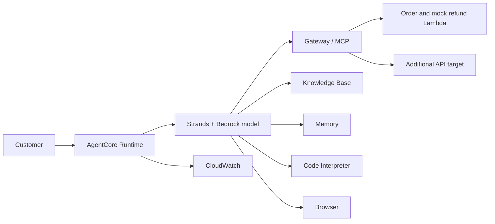

# Build Bedrock Support Agent

A complete educational customer support application built with **Amazon Bedrock AgentCore** and the **Strands SDK**. This folder puts the application at the project root so you can open it directly in your editor and configure your own deployment.

## Capabilities

- Track fictional orders and process mock refunds through Gateway/MCP tools.
- Answer catalog and policy questions using the Bedrock Knowledge Base Retrieve API.
- Save customer context and recall it across sessions with AgentCore Memory.
- Calculate loyalty discounts in AgentCore Code Interpreter, with a documented fallback.
- Read live web pages using the AgentCore Browser tool.
- Run as a cloud application through `BedrockAgentCoreApp` and an async entrypoint.



## Start building

Install Python 3.13, uv, AWS CLI v2, and Git. From the repository root:

```powershell
cd build-bedrock-support-agent
uv sync --locked --python 3.13
uv run python -m unittest discover -s tests -v
```

The tests use the real SDK imports with mocked AWS, model, and MCP boundaries. They do not prove a live deployment. Continue with [RUNBOOK.md](RUNBOOK.md) to create and configure your own cloud resources.

## Project files

| File | Purpose |
| --- | --- |
| [main.py](main.py) | Runtime entrypoint, agent, tools, memory hooks, and failure handling |
| [lambda/order_tracker.py](lambda/order_tracker.py) | Fictional order lookup Lambda |
| [lambda/refund_processor.py](lambda/refund_processor.py) | Mock refund Lambda |
| [lambda/lambda_schema](lambda/lambda_schema) | Gateway tool schema |
| [product_catalog.txt](product_catalog.txt) | Sample Knowledge Base ingestion document |
| [.env.example](.env.example) | Configuration variable names without credentials |
| [pyproject.toml](pyproject.toml) and [uv.lock](uv.lock) | Dependencies and reproducible classroom versions |
| [Dockerfile](Dockerfile) | Container build definition |
| [tests/test_agent.py](tests/test_agent.py) | 22 boundary and behavior tests |
| [scripts/invoke_cli.py](scripts/invoke_cli.py) | Capture the real `agentcore invoke` command and output |
| [REFLECTION.md](REFLECTION.md) | Design decisions and historical project lessons |

## Learn and verify

- [Complete learning book and diagrams](../agentcore-customer-support/README.md)
- [Six scenarios and submission checklist](../agentcore-customer-support/docs/TESTING.md)
- [Official learning resources](../agentcore-customer-support/docs/RESOURCES.md)

This folder is the buildable application snapshot. The book's `companion/reference` folder preserves its original reference edition. If you change this project, do not assume the book snapshot changes automatically.

## Scope and limitations

Use fictional customers and mock payments. This is a classroom implementation with caller-supplied customer identity, consent bypass, unauthenticated Gateway transport, and a browser lifecycle adapter that uses private SDK details. The sample calculator's Gold policy and catalog policy differ; reconcile them before relying on real quotes. Gateway startup failure currently ends the request.

No deployed runtime, credentials, account configuration, or historical screenshots are bundled here. You must provision a Knowledge Base, Memory, Gateway and targets, and appropriate execution permissions. For the reviewer requirement, add an API-based Gateway target as well as a Lambda target; two Lambda tools alone are insufficient.

Preserve the [original license](LICENSE.txt) and [repository attribution](../NOTICE.md). The reflection describes previous project work; it is not evidence of a fresh deployment from this folder.
